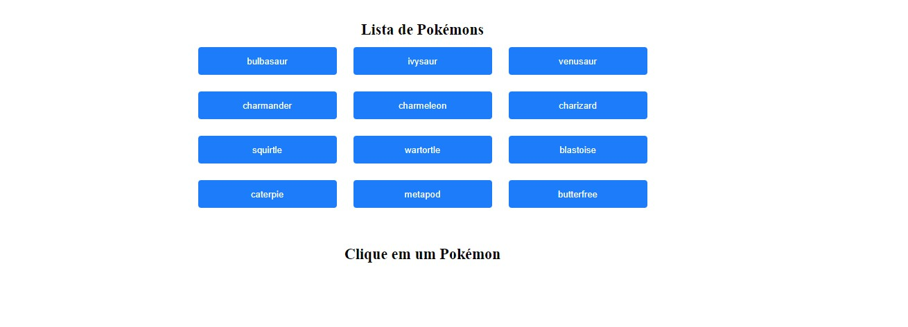
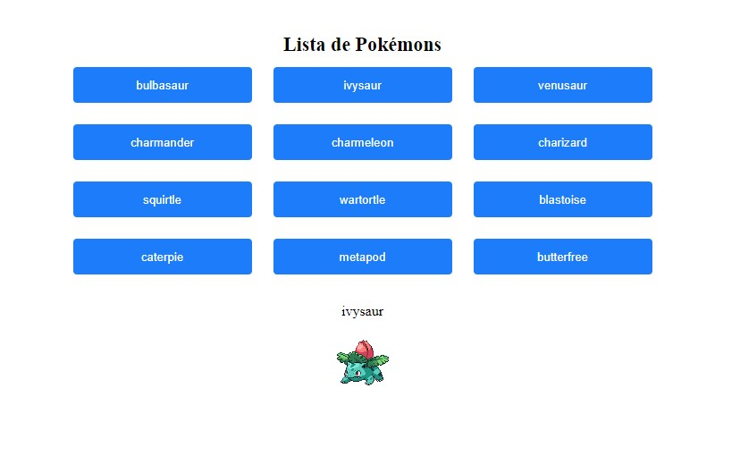

# Frontend Developer - Test

## Detalhes ##
Temos uma primeira tela exibindo um botão de 'Buscar pokémons':

Esse botão ao clicar irá exibir a Pokédex com somente os 12 primeiros pokémons:

Ao clicar em um pokémon, precisará exibir o nome dele e a foto dele:

